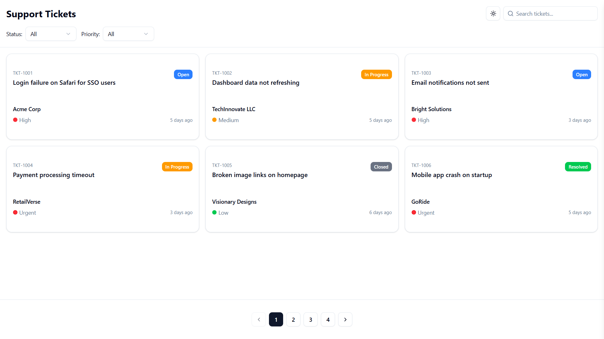
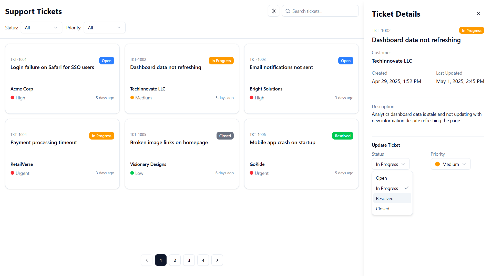
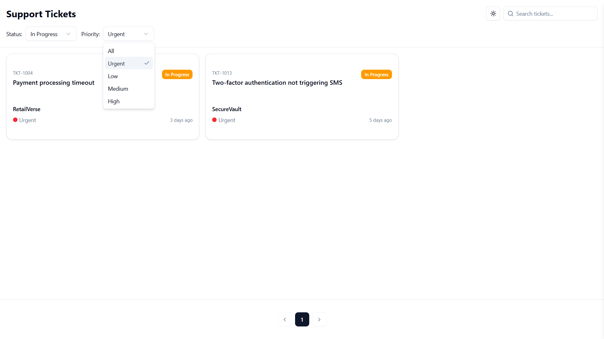
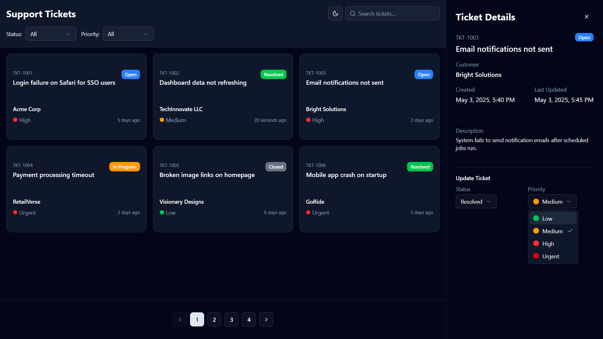

# 🛠️ Support Ticket Dashboard

A clean and responsive web application to view, search, filter, and update customer support tickets — built as part of the Solosphere frontend assignment.

### 🚀 [Live Demo](https://support-ticket-gamma.vercel.app/)

---

## 📌 Features

- 🔍 **Search Tickets**: Real-time search by title, customer name, etc.
- 🎯 **Filter by Status & Priority**: Dropdown filters to quickly narrow down results.
- 📋 **View Ticket Details**: Click on a ticket to view its full details in a modal.
- 🔄 **Update Ticket Status**: Change the ticket’s status (Open, In Progress, Resolved) directly from the detail view.
- 🌓 **Responsive Design**: Fully functional across desktop and mobile devices.
- 🎨 **Clean & Minimal UI**: Simple, modern design with accessible layout.

---

## 📷 Screenshots

Dashboard 
Ticket Details 
Filters
Dark Mode

---

## 🧑‍💻 Tech Stack

- **React.js** – Frontend library
- **CSS Modules / Tailwind / Styled-Components / Shadcn-ui** - CSS and Design
- **React Hooks** – `useState`, `useEffect` for state management

---

## 🛠️ Getting Started

```bash
# Clone the repository
git clone https://github.com/Vaibhav-Chitransh/Solsphere-Frontend-Assignment.git
cd Solsphere-Frontend-Assignment

# Install dependencies
npm install

# Start the development server
npm run dev  
